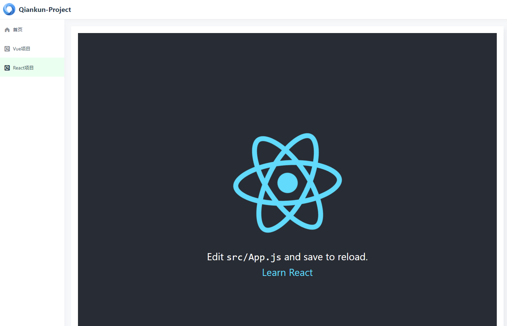

# qiankun微前段搭建vue和react项目，使用nginx部署相关注意事项
## 项目运行图片


## 运行项目
1. 下载父项目哥子项目各自的依赖
2. 先运行子项目，再运行父项目。如果子项目端口有变化需要修改父项目里的配置，访问父项目查看效果
3. 父项目的配置信息在 qiankun-parent/src/default-app.js
```javascript
let apps
if (process.env.NODE_ENV === 'production') {
  // 打包 部署的配置
  apps = [ 
    {
      name:'qiankun-child-vue', // 应用的名字
      entry:'/child/vue1/', // 默认会加载这个html 解析里面的js 动态的执行 （子应用必须支持跨域）fetch
      container:'#container', // 容器名
      activeRule:'/vue1' // 激活的路径
    }
  ]
} else {
  // 开发运行配置
  apps = [ 
    {
      name:'qiankun-child-vue', // 应用的名字
      entry:'//localhost:10002', // 默认会加载这个html 解析里面的js 动态的执行 （子应用必须支持跨域）fetch
      container:'#container', // 容器名
      activeRule:'/qiankun-child-vue' // 激活的路径
    },
    {
      name:'qiankun-child-react', // 应用的名字
      entry:'//localhost:3000', // 默认会加载这个html 解析里面的js 动态的执行 （子应用必须支持跨域）fetch
      container:'#container', // 容器名
      activeRule:'/qiankun-child-react' // 激活的路径
    }
  ]
}

export default apps
```

## 一 新建vue子项目注意事项 -- 推荐参考官方文档[https://qiankun.umijs.org/zh]
1. 新建vue.config.js
```javascript
module.exports = {
    // 这里需要注意，将生产环境的地址改为和路由base保持一致
    /*
        const router = new VueRouter({
            routes,
            mode: 'history',
            base: window.__POWERED_BY_QIANKUN__ ? '/qiankun-child-vue' : '/',
        })
    */
    publicPath: process.env.NODE_ENV === 'production' ? '/qiankun-child-vue' : '/',
    devServer:{
        port: 10002,
        headers:{
            'Access-Control-Allow-Origin':'*' // 允许跨域
        }
    },
    configureWebpack:{
        output:{
            library:'qiankun-child-vue', // 项目名称
            libraryTarget:'umd' // 把微应用打包成 umd 库格式
        }
    }
}
```
2. 在 src 目录新增 public-path.js
```javascript
if (window.__POWERED_BY_QIANKUN__) {
  __webpack_public_path__ = window.__INJECTED_PUBLIC_PATH_BY_QIANKUN__;
}
```
3. 入口文件 main.js 修改，为了避免根 id #app 与其他的 DOM 冲突，需要限制查找范围。
```javascript
import './public-path'
import Vue from 'vue'
import App from './App.vue'
import router from './router'
import store from './store'

Vue.config.productionTip = false
let instance
function render(props = {}) {
  const { container } = props;
  instance = new Vue({
    router,
    store,
    render: h => h(App)
  }).$mount(container ? container.querySelector('#app') : '#app')
}


// 独立运行时
if (!window.__POWERED_BY_QIANKUN__) {
  render();
}

export async function bootstrap() {
  console.log('[vue] vue app bootstraped');
}
export async function mount(props) {
  console.log('[vue] props from main framework', props);
  render(props);
}
export async function unmount() {
  instance.$destroy();
  instance.$el.innerHTML = '';
  instance = null;
}
```
4. 修改router/index.js
```javascript
const router = new VueRouter({
  mode: 'history',
  base: window.__POWERED_BY_QIANKUN__ ? '/qiankun-child-vue' : '/', // 添加跳转前缀
  routes
})
```
5. 在父项目添加的配置
```javascript
{
    name:'qiankun-child-vue', // 子项目名称
    entry:'//localhost:10002', // 默认会加载这个html 解析里面的js 动态的执行 （子应用必须支持跨域）fetch
    container:'#container',
    activeRule:'/qiankun-child-vue', // 对应路由的 base
}
```

## 二 新建react子项目注意事项 -- 推荐参考官方文档[https://qiankun.umijs.org/zh]
1. 在 src 目录新增 public-path.js
```javascript
if (window.__POWERED_BY_QIANKUN__) {
  __webpack_public_path__ = window.__INJECTED_PUBLIC_PATH_BY_QIANKUN__;
}
```
2. 设置 history 模式路由的 base：
```javascript
<BrowserRouter basename={window.__POWERED_BY_QIANKUN__ ? '/qiankun-child-react' : '/'}>
```
3. 入口文件 index.js 修改，为了避免根 id #root 与其他的 DOM 冲突，需要限制查找范围。
4. 修改 webpack 配置

    - 安装插件 react-app-rewired。
      ```shell
        npm i -D react-app-rewired
      ```

    - 根目录新增 config-overrides.js：
      ```javascript
        module.exports = {
        webpack: function override(config, env) {
          config.output.library = `qiankun-child-react`;
          config.output.libraryTarget = 'umd';
          return config;
        },
        devServer: (configFunction) => {
          return function (proxy, allowedHost) {
            const config = configFunction(proxy, allowedHost);
            config.open = false;
            config.hot = false;
            config.port = 10003;
            config.headers = {
              'Access-Control-Allow-Origin': '*',
            };
            return config;
          };
        },
      };
      ```

    - 修改 package.json：
      ```
        -   "start": "react-scripts start",
        +   "start": "rescripts start",
        -   "build": "react-scripts build",
        +   "build": "rescripts build",
        -   "test": "react-scripts test",
        +   "test": "rescripts test",
        -   "eject": "react-scripts eject"
      ```

4. 在父项目添加的配置
```javascript
{
    name:'qiankun-child-react', // 子项目名称
    entry:'//localhost:3000', // 默认会加载这个html 解析里面的js 动态的执行 （子应用必须支持跨域）fetch
    container:'#container',
    activeRule:'/qiankun-child-react', // 对应路由的 base
}
```
